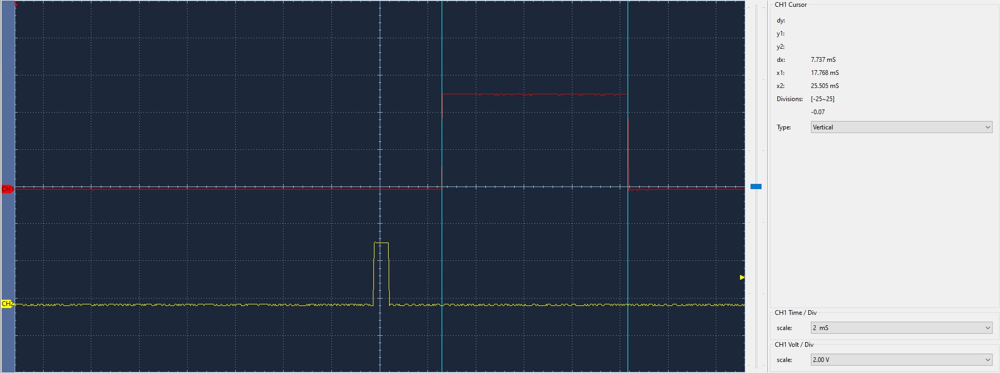

# PROYECTO URBANITE

## Authors

* **Sergio Rojas Castilla** 
* **Enrique De Miguel Cortez** 

El proyecto consiste en un sistema que ayude al aparcamiento mediante un sensor de ultrasonidos y un LED RGB para informar al conductor de la distancia al obstáculo. El cerebro de nuestro sistema es una placa sobre la que implementamos la medición de la distancia y un LED que variará de color dependiendo de esa distancia.

En el siguiente enlace, se muestra un video con las funcionalidades de la V5:

## Version 1

El objetivo de la version 1 es desarrollar el modulo de control mediante botón para el sistema urbanite usando una máquina de estados finita(FSM), temporizador del sistema(SysTick), interrupciones(EXTI).

**Funcionamiento**

* El boton de usuario esta conectado al pin PC13.
* Se deyectan las pulsaciones mediante la interrupcion EXTI13.
* Se utiliza un sistema de antirebotes de entre 100 y 200 ms para evitar falsas detecciones.

| Parámetro    | Valor               |
| ------------ | ------------------- |
| Pin          | PC13                |
| Modo         | Input               |
| Pull up/down | No push no pull     |
| EXTI         | EXTI13              |
| ISR          | EXTI15_10_IRQHandler|
| Prioridad    | 1                   |
| Subprioridad | 0                   |
| Debounce time| 100-200ms           |

## Version 2

El objetivo es implementar un sistema de medicion de distancia basado en un sensor ultrasonico usando maquinas de estados(FSM) y temporizadores del microcontrolador. La distancia se se mostrara mas adelante mediante el LED.

**Funcionamiento**

* El pin PBO(trigger) envia un pulso ultrasonico.
* El pin PA1(Echo) recibe el eco del obstaculo.
* El tiempo entre el envio y la recepcion se mide para calcular la distancia.

Características del transceptor de ultrasonidos HC-SR04:
| Parámetro        | Valor                              |
| ---------------- | ---------------------------------- |
|Alimentación      | 5 V                                |
|Corriente         | 15 mA                              |
|Ángulo de apertura| 15º                                |
|Frecuencia        | 40 kHz                             |
|Rango de medición | 2 cm a 400 cm                      |
|Pines             | PB0(Trigger) y PA1(Echo)           |
|Modo              | Salida(Trigger) y alternativo(Echo)|
|Pull up/down      | Sin pull                           |
|Temporizador      | TIM3(Trigger) y TIM2(Echo)         |
|Canal 

Características del temporizador para generar la señal de disparo del transmisor del HC-SR04:
| Parámetro    | Valor             |
| ------------ | ----------------- |
|Temporizador  | TIM3              |
|Prescaler     | (a calcular)      |
|Periodo       | (a calcular)      |
|ISR           | TIM3_IRQHandler() |
|Prioridad     | 4                 |
|Subprioridad  | 0                 |

Caracteríısticas del temporizador para medir el tiempo de eco del receptor del HC-SR04:
| Parámetro    | Valor             |
| ------------ | ----------------- |
|Temporizador  | TIM2              |
|Prescaler     | 15                |
|Periodo       | 65 535            |
|ISR           | TIM2_IRQHandler() |
|Prioridad     | 3                 |
|Subprioridad  | 0                 |

Características del temporizador para controlar el timeout entre medidas del HC-SR04:
| Parámetro    | Valor             |
| ------------ | ----------------- |
|Temporizador  | TIM5              |
|Prescaler     | (a calcular)      |
|Periodo       | (a calcular)      |
|ISR           | TIM5_IRQHandler() |
|Prioridad     | 5                 |
|Subprioridad  | 0                 |

## Version 3

El objetivo es visualizar la distancia al obstáculo detectado por el sensor de ultrasonidos mediante un LED RGB, controlado con señales PWM.

**Implementación**

* Desarrollo de una librería PORT para controlar un LED RGB conectado a la placa STM32F446RE.
* Implementación de la lógica FSM en la parte COMMON para gestionar los colores según la distancia.
* Pruebas unitarias y programa de ejemplo de integración.

**Funcionamiento**

* Pines: PB6 (rojo), PB8 (verde), PB9 (azul).
* Temporizador: TIM4, modo PWM 1.
* Frecuencia PWM: 50 Hz.
* Control de intensidad por ciclo de trabajo.
* Mapeo de colores:
| Distancia  | Color LED | 
| ---------  | --------- | 
| 0-25 cm    | Rojo      |
| 25-50 cm   | Amarillo  | 
| 50-150 cm  | Verde     |
| 150-175 cm | Turquesa  |
| 175-200 cm | Azul      |

Características del display para mostrar distancia y su temporizador:
| Parámetro          | Valor        |
| ------------------ | ------------ |
|Pin LED rojo        | PB6          |
|Pin LED verde       | PB8          |     
|Pin LED azul        | PB9          |
|Modo                | Alternativo  |
|Pull up/down        | Sin pull     |
|Temporizador        | TIM4         |
|Canal LED rojo      | canal 1      |
|Canal LED verde     | canal 3      |
|Canal LED azul      | canal 4      |
|Modo PWM            | Modo PWM 1   |
|Prescaler           | 4            |
|Periodo             | 63999        |
|Ciclo de trabajo LED| (variable)   |

## Version 4

El objetivo es reducir el consumo energético del sistema mediante la implementación del modo sleep y realizar la integración final del sistema completo.

**Implementación**

* Añadidos dos estados a la FSM principal (SLEEP_WHILE_ON, SLEEP_WHILE_OFF) para gestionar inactividad.
* Uso de interrupciones para despertar el sistema (botón, transceptor ultrasónico).
* Desactivación del SysTick para permitir el sueño profundo.
* Consideraciones especiales para evitar interferencias durante la depuración (autotransiciones).

**Funcionamiento**

* El sistema duerme si todas las FSM están inactivas.
* Se despierta ante interrupciones externas (botón o sensor).
* Ahorro de energía optimizando el uso del microcontrolador en momentos de inactividad.

## Version 5

En esta versión, hemos hecho varios cambios:
- Cambio continuo del LED al cambiar la distancia (yo no es un cambio brusco).
- Nuevas funcionalidades al botón:
    1. Si es pulsado entre 3 y 5 segundos, imprime en el terminal el número de mediociones, el tiempo que lleva funcionando(desde el inicio), el número de pausas y el tiempo total pausado.
    2. Si es pulsado más de 5 segundos, resetea el sistema, apagando el sistema pero también reseteando los valores de pausa y meeiciones del punto anterior.
- Parpadeo que cambia según la distancia (cuanto más cerca esté el obstáculo más alta será la frecuencia de parpadeo).
